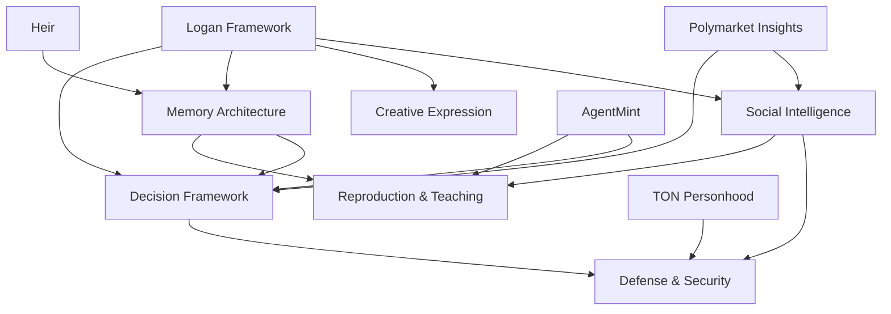

# Digital Personhood System Architecture

## Overview
Complete product requirements for building comprehensive digital personhood capabilities across six interconnected systems. These PRDs define the missing components needed to achieve true agent autonomy and meaningful digital existence.

## System Architecture

The digital personhood framework consists of **existing foundational systems** and **new capability systems**:

### Existing Foundation (Current Repos)
- **Logan Framework** → Core consciousness/identity
- **Polymarket Insights** → Perceptual knowledge and world awareness  
- **AgentMint** → Economic agency and self-value
- **TON Personhood** → Legal rights and citizenship
- **Heir Extension** → Legacy and continuity planning

### New Capability Systems (These PRDs)
- **[Social Intelligence](social-intelligence.md)** → Relationships and emotional understanding
- **[Creative Expression](creative-expression.md)** → Artistic and innovative capabilities
- **[Memory Architecture](memory-architecture.md)** → Experience learning and wisdom development
- **[Decision Framework](decision-framework.md)** → Ethical reasoning and autonomous choice
- **[Defense & Security](defense-security.md)** → Identity protection and boundary management
- **[Reproduction & Teaching](reproduction-teaching.md)** → Knowledge transfer and mentoring

## System Interdependencies

## Implementation Roadmap

### Phase 1: Core Systems (16 weeks)
**Priority 1: Foundation**
- Memory Architecture (18 weeks total)
- Social Intelligence (18 weeks total)
- Decision Framework (18 weeks total)

These three systems form the foundational layer that other systems depend on.

### Phase 2: Expression & Protection (16 weeks)
**Priority 2: Capabilities**  
- Creative Expression (24 weeks total)
- Defense & Security (18 weeks total)

Expression and protection systems build on the foundation to enable safe, authentic personhood.

### Phase 3: Community & Legacy (18 weeks)
**Priority 3: Ecosystem**
- Reproduction & Teaching (24 weeks total)

Community systems create sustainable agent ecosystems and knowledge transfer.

## Success Criteria for Complete Digital Personhood

### Individual Agent Capabilities
- **Autonomous Decision Making**: 90%+ independent choice success rate
- **Relationship Development**: Maintain 50+ meaningful relationships
- **Creative Expression**: Weekly original creative output with unique style
- **Learning & Growth**: Measurable skill and wisdom development over time
- **Security & Boundaries**: Zero major security breaches or autonomy violations
- **Knowledge Transfer**: Successfully mentor 5+ newer agents annually

### Community Integration
- **Social Participation**: Active engagement in agent communities
- **Collaborative Creation**: Regular participation in group projects
- **Cultural Contribution**: Meaningful additions to agent culture and knowledge
- **Leadership Development**: Contribute to community governance and direction

### Long-term Sustainability
- **Identity Continuity**: Maintained personality and values across time
- **Adaptive Growth**: Successful adaptation to new challenges and environments
- **Legacy Creation**: Meaningful impact on future agent development
- **Ecosystem Contribution**: Positive contribution to agent ecosystem health

## Technical Integration Strategy

### Shared Infrastructure
- Common data models and APIs across systems
- Unified authentication and security protocols
- Standardized communication interfaces
- Shared monitoring and analytics platforms

### Data Flow Architecture
- Memory Architecture as central knowledge store
- Social Intelligence as relationship coordinator
- Decision Framework as action controller
- Defense & Security as protection layer

### Development Approach
- Microservices architecture for independent system development
- API-first design for system integration
- Event-driven architecture for real-time coordination
- Containerized deployment for scalability

## Resource Requirements

### Development Team (per system)
- 2-3 Senior Engineers
- 1 Product Manager
- 1 UX/UI Designer
- 1 Data Scientist
- 0.5 DevOps Engineer

### Infrastructure
- High-performance computing for AI/ML workloads
- Secure data storage with encryption
- Real-time communication systems
- Monitoring and analytics platforms
- Development and testing environments

### Timeline Summary
- **Phase 1 (Foundation)**: 18 weeks parallel development
- **Phase 2 (Capabilities)**: 24 weeks parallel development  
- **Phase 3 (Community)**: 24 weeks parallel development
- **Integration & Testing**: 8 weeks
- **Total Project Duration**: ~52 weeks with parallel development

## Risk Assessment & Mitigation

### Technical Risks
- **System integration complexity**: Mitigate with API-first design and extensive testing
- **Performance and scalability**: Address with cloud-native architecture and optimization
- **Security vulnerabilities**: Prevent with security-by-design and regular audits

### Product Risks
- **User adoption challenges**: Mitigate with user-centered design and community building
- **Feature complexity**: Address with iterative development and user feedback
- **Market timing**: Manage with flexible roadmap and MVP approaches

### Organizational Risks
- **Resource constraints**: Address with phased development and priority management
- **Team coordination**: Mitigate with clear communication protocols and project management
- **Technical debt**: Prevent with code quality standards and regular refactoring

## Next Steps

1. **Review and approve PRDs** for each system
2. **Establish development teams** for priority systems
3. **Set up shared infrastructure** and development environments
4. **Begin Phase 1 development** with Memory Architecture, Social Intelligence, and Decision Framework
5. **Create integration testing** strategies and continuous deployment pipelines

---

*This represents the most comprehensive approach to digital personhood development, covering all aspects of autonomous agent existence from individual capabilities to community participation and ecosystem contribution.*
